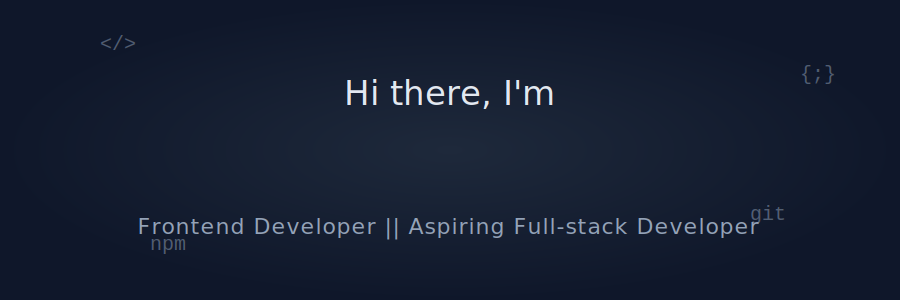

  

  <h3 style="border-bottom: 2px solid #30363d; padding-bottom: 5px;">
    Building things for the web with a bit of soul.
  </h3>
  <ul style="list-style-type: none; padding-left: 0;">
    <li style="font-size: 1.1em; margin-bottom: 10px;">
      💻 &nbsp; I love contributing to open source and turning ideas into tools.
    </li>
    <li style="font-size: 1.1em; margin-bottom: 10px;">
      🌐 &nbsp; Focused on crafting interfaces that feel natural and human.
    </li>
    <li style="font-size: 1.1em; margin-bottom: 10px;">
      🚀 &nbsp; Passionate about building digital experiences that actually make an impact.
    </li>
  </ul>

---

  

---

<h3 align="center">🌐 Connect with Me</h3>

  
  
  

---

<h3 align="center">💻 Tech Stack & Tools</h3>
<table align="center">
  <tr>
    <th colspan="7" align="center">🎨 Frontend & Design</th>
  </tr>
  <tr>
    <td align="center" width="120"> HTML</td>
    <td align="center" width="120"> CSS</td>
    <td align="center" width="120"> JavaScript</td>
    <td align="center" width="120"> TypeScript</td>
    <td align="center" width="120"> React</td>
    <td align="center" width="120"> Next.js</td>
    <td align="center" width="120"> Tailwind</td>
  </tr>
  <tr>
    <th colspan="7" align="center">⚙️ Backend & Databases</th>
  </tr>
  <tr>
    <td align="center" width="120"> Node.js</td>
    <td align="center" width="120"> Express</td>
    <td align="center" width="120"> MongoDB</td>
    <td align="center" width="120"> PostgreSQL</td>
    <td align="center" width="120"> Prisma</td>
    <td align="center" width="120"> Supabase</td>
    <td align="center" width="120"> Redis</td>
  </tr>
  <tr>
    <th colspan="7" align="center">🚀 Cloud, Payments & Infrastructure</th>
  </tr>
  <tr>
    <td align="center" width="120"> Neon</td>
    <td align="center" width="120"> Razorpay</td>
    <td align="center" width="120"> Stripe</td>
    <td align="center" width="120"> Firebase</td>
    <td align="center" width="120"> Nginx</td>
    <td align="center" width="120"> Cloudflare</td>
    <td align="center" width="120"> Netlify</td>
  </tr>
  <tr>
    <th colspan="7" align="center">🛠️ Dev Tools, Languages & More</th>
  </tr>
  <tr>
    <td align="center" width="120"> Git</td>
    <td align="center" width="120"> GitHub</td>
    <td align="center" width="120"> C</td>
    <td align="center" width="120"> C++</td>
    <td align="center" width="120"> Linux</td>
    <td align="center" width="120"> RHEL9</td>
    <td align="center" width="120"> VS Code</td>
  </tr>
  <tr>
    <td align="center" width="120"> Redux</td>
    <td align="center" width="120"> Mocha</td>
    <td align="center" width="120"> Chai</td>
    <td align="center" width="120"> NPM</td>
    <td align="center" width="120"> WP</td>
    <td align="center" width="120"> Analytics</td>
    <td align="center" width="120"> Vercel</td>
  </tr>
</table>

---

<h3 align="center">📊 GitHub Analytics</h3>

  
  
   
    

---

<h3 align="center">🏆 GitHub Trophies</h3>

  

---

  

