  

<h3>A detail-oriented Frontend Developer currently expanding my expertise to become a comprehensive Full-Stack Engineer.</h3>

<ul>

<li>🚀 Architecting intuitive user interfaces with a focus on clean, efficient code.</li>

<li>🌱 Evolving my skills in backend and cloud infrastructure to build end-to-end solutions.</li>

<li>💡 Passionate about problem-solving, collaboration, and continuous learning.</li>

</ul>

  

---

<h3 align="center">🌐 Connect with Me</h3>

  
  
  

---

<h3 align="center">💻 Tech Stack & Tools</h3>
<table align="center">
  <tr>
    <td align="center" width="120">
      
       HTML
    </td>
    <td align="center" width="120">
      
       CSS
    </td>
    <td align="center" width="120">
      
       JavaScript
    </td>
    <td align="center" width="120">
      
       React
    </td>
    <td align="center" width="120">
      
       Redux
    </td>
    <td align="center" width="120">
      
       Node.js
    </td>
    <td align="center" width="120">
      
       MongoDB
    </td>
  </tr>
  <tr>
    <td align="center" width="120">
      
       Firebase
    </td>
    <td align="center" width="120">
      
       WordPress
    </td>
    <td align="center" width="120">
      
       C
    </td>
    <td align="center" width="120">
      
       C++
    </td>
    <td align="center" width="120">
      
       Python
    </td>
    <td align="center" width="120">
      
       AWS
    </td>
    <td align="center" width="120">
      
       Netlify
    </td>
  </tr>
  <tr>
    <td align="center" width="120">
      
       Cloudflare
    </td>
    <td align="center" width="120">
      
       Git
    </td>
    <td align="center" width="120">
      
       GitHub
    </td>
    <td align="center" width="120">
      
       VS Code
    </td>
    <td align="center" width="120">
      
       Kali Linux
    </td>
    <td align="center" width="120">
      
       Analytics
    </td>
    <td align="center" width="120">
      
       Tailwind CSS
    </td>
  </tr>
</table>

---

<h3 align="center">📊 GitHub Analytics</h3>

  
  
   
  

---

<h3 align="center">🏆 GitHub Trophies</h3>

  

  

  

